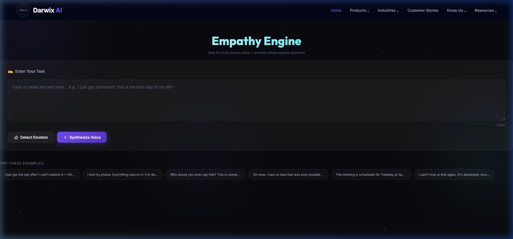

# 🎙️ Darwix AI — Challenge Submissions

> **Two AI-powered challenges, one repo.** Built for the Darwix AI interview, these projects showcase emotion-driven voice synthesis and text-to-storyboard generation with a premium Web3-inspired UI.

---

## 🖼️ Screenshots

### Challenge 1 — The Empathy Engine


> A premium dark-mode FastAPI app with a Darwix AI branded nav, animated ambient orbs, and live emotion-to-voice synthesis.

---

### Challenge 2 — The Pitch Visualizer
> A cinematic storyboard generator that streams AI-generated panels in real-time using Server-Sent Events.

---

## 📦 Projects

| Challenge | Description | Local URL |
|-----------|-------------|-----------|
| 🎙️ Empathy Engine | Detects emotion from text, modulates TTS pitch/rate/volume using `edge-tts` | `localhost:8000/empathy-engine/` |
| 🎬 Pitch Visualizer | Converts a pitch narrative into a streaming storyboard via Gemini + Stable Diffusion | `localhost:8001/pitch-visualizer/` |

---

# 🎙️ Empathy Engine — AI Voice with a Human Soul

> Give AI a voice that feels. The Empathy Engine detects the emotion in any text and modulates the synthesized speech to match — naturally, expressively, humanly.

---

## 🌟 What It Does

| Input | Output |
|-------|--------|
| `"I just got the job offer! This is amazing!"` | Fast, high-pitched, energetic voice 😊 |
| `"I lost my grandfather today. I'm devastated."` | Slow, low-pitched, soft voice 😢 |
| `"This is completely unacceptable!"` | Rapid, loud, high-pitched voice 😠 |
| `"The meeting is at 3pm in Room B."` | Normal, neutral voice 😐 |

---


## 🧠 Architecture & Design Choices

### 1. Emotion Detection: HuggingFace `distilroberta`
- **Model**: `j-hartmann/emotion-english-distilroberta-base` — a fine-tuned DistilRoBERTa classifying 7 emotions: `joy`, `sadness`, `anger`, `fear`, `disgust`, `surprise`, `neutral`
- **Why**: Far more accurate than TextBlob for emotion (not just polarity). Runs locally on CPU, no API key needed.
- **Fallback**: TextBlob polarity when the HF model is unavailable.

### 2. Intensity Scaling
TextBlob's `polarity` and `subjectivity` scores combine into an **intensity multiplier** (0.3–1.0):
```
intensity = clip(|polarity| × 0.6 + subjectivity × 0.4, 0, 1)
actual_shift = base_shift × (0.3 + 0.7 × intensity)
```
So `"This is good"` gets a slight lift, while `"This is THE BEST NEWS EVER!"` gets maximum modulation.

### 3. Vocal Parameter Mapping

| Emotion | Rate | Pitch | Volume |
|---------|------|-------|--------|
| Joy | Fast | +5 st | +3 dB |
| Sadness | Slow | −4 st | −3 dB |
| Anger | X-Fast | +3 st | +5 dB |
| Fear | Fast | −2 st | −1 dB |
| Disgust | Slow | −1.5 st | −2 dB |
| Surprise | Fast | +7 st | +4 dB |
| Neutral | Medium | 0 st | 0 dB |

### 4. TTS Pipeline
1. `gTTS` → Google's TTS generates a baseline MP3
2. `pydub` → adjusts volume (dB gain), speed (frame-rate trick)
3. `ffmpeg` → applies pitch shift via `asetrate` filter (if installed)
4. `pyttsx3` → full offline fallback when internet is unavailable

### 5. SSML
Rate labels (`slow`, `fast`, `x-fast`) map to SSML `<prosody rate="">` tags in the voice config for future SSML-capable TTS backends.

---

## 🚀 Quick Start

### Prerequisites
- Python 3.10+
- `ffmpeg` installed ([download](https://ffmpeg.org/download.html)) — *optional but recommended for pitch shifting*

### 1. Install dependencies

```bash
cd empathy-engine
pip install -r requirements.txt
python -m textblob.download_corpora   # download TextBlob corpora
```

> The HuggingFace model (~80MB) downloads automatically on first run.

### 2. Run the server

```bash
uvicorn main:app --reload --port 8000
```

### 3. Open the app

📍 **http://localhost:8000**

---

## 📡 API Reference

### `POST /analyze`
Detect emotion without generating audio.
```json
{ "text": "I can't believe this! This is incredible!" }
```
Returns:
```json
{
  "emotion": "surprise",
  "intensity": 0.82,
  "confidence": 0.94,
  "all_scores": { "surprise": 0.94, "joy": 0.04, ... },
  "voice_config": { "rate": "fast", "pitch_st": 5.74, "volume_db": 3.28 }
}
```

### `POST /synthesize`
Detect emotion AND generate a `.wav` file.
```json
{ "text": "I just got promoted!" }
```
Returns JSON with `audio_url` pointing to your generated file.

---

## 📁 Project Structure

```
empathy-engine/
├── main.py              # FastAPI app & routes
├── emotion_detector.py  # HuggingFace/TextBlob emotion detection
├── tts_engine.py        # gTTS + pydub modulation pipeline
├── emotion_voice_map.py # Emotion → VoiceConfig mapping + intensity scaling
├── templates/
│   └── index.html       # Premium dark-mode web UI
├── static/
│   ├── styles.css       # Glassmorphism dark theme
│   └── app.js           # Frontend logic
├── outputs/             # Generated .wav files
└── requirements.txt
```

---

## 🎁 Bonus Features Implemented

- ✅ **7 Granular Emotions** (not just positive/negative/neutral)
- ✅ **Intensity Scaling** (mild vs. extreme modulation)
- ✅ **Web Interface** with live audio player
- ✅ **SSML-ready** prosody rate labels
- ✅ **Offline fallback** via pyttsx3

---

*Built with ❤️ for the Darwix AI interview challenge.*
